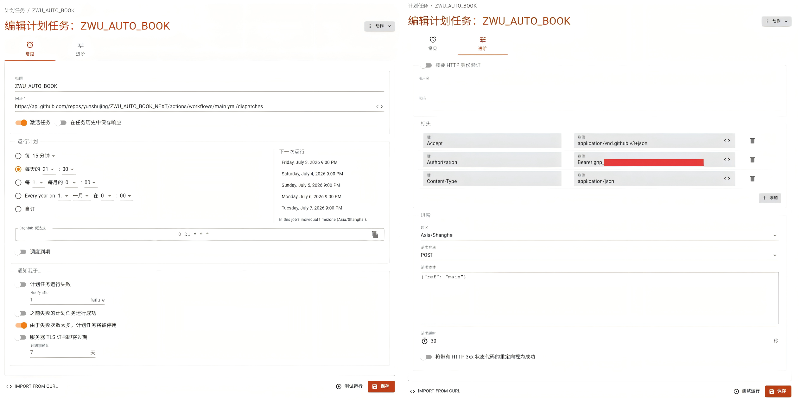

# ZWU AUTO BOOK NEXT — 浙江万里学院图书馆自动预约脚本

> ***"当笔墨铺就的栈道缓缓延伸，你伏案笃学沉淀的恒心自会成帆，载你走遍万里风光的求索征途。"***

> [!IMPORTANT]
> 请遵守以下使用协议，若不同意此协议，请移步其它项目
>
> <details><summary>使用协议</summary>
>
> - 本项目仅供学术交流使用，作者不对任何因使用本脚本造成的后果负责
> - 请合理使用，切勿占用公共资源（预约但不去签到等行为）
> - 滥用脚本可能导致封号、账号锁定等后果
> - 本项目将停止维护并将被移除，当发生以下情况之一:
>   - 本项目被浙江万里学院图书馆或校方要求删除
>   - 作者发现本项目影响到了图书馆正常的预约服务
>   - 作者发现本项目被滥用或有其他不妥之处
> - 当本项目被移除后，请各位使用者自觉停止使用 fork 的代码，以免造成不必要的麻烦。
>
> </details>

> [!NOTE]
> 本项目基于 [ZWU_AUTO_Booking](https://github.com/ZWUTA/ZWU_AUTO_Booking) 进行重构与功能扩展。

---

## 📑 目录

- [✨ 功能特性](#-功能特性)
- [🚀 快速开始](#-快速开始github-actions-自动预约)
- [📋 自习室编号对照](#-自习室编号对照)
- [📦 配置参数说明](#-配置参数说明)
- [💬 通知配置](#-通知配置)
- [🖥️ 本地化部署](#️-本地化部署)
- [🧪 测试与验证](#-测试与验证)
- [📁 文件结构](#-文件结构)
- [🙏 致谢](#-致谢)
- [📄 开源协议](#-开源协议)

---

## ✨ 功能特性

- 🔐 **自动登录** — Selenium headless Chrome，无需手动操作
- ⚡ **两阶段抢座** — 先批量登录拿到会话（浏览器用完即关），再按可配置并发度抢座；**登录不占用抢座窗口**
- 🪑 **智能选座** — 自动搜索可用座位，优先偶数编号（假设有插座）
- 🎯 **指定座位** — 直接填座位号（自动转换ID）或座位ID，按优先级依次尝试
- ⏰ **手动/定时预约** — 支持手动触发，也可配置 GitHub Actions 定时触发
- 🔍 **DRY RUN 自检** — 只验证登录、不预约、不发通知，可安全验证配置与登录链路
- 💬 **微信通知** — Server酱推送预约结果（成功含日期时间座位，失败含原因）
- 👥 **多账号管理** — 支持多账号，每个账号可单独配置参数
- 🖥️ **本地运行** — 支持本地直接运行，无需依赖外部服务

---

## 🚀 快速开始（GitHub Actions 自动预约）

### 1. Fork 仓库

点击右上角 **Fork**，将仓库复制到你的 GitHub 账号下。

### 2. 配置账号

本项目提供三种配置方式，**按需任选其一**即可。点击下方展开查看各方式详情。

> [!TIP]
> 三种方式优先级：若同时配置了多种，脚本按 本地文件 > `ACCOUNTS` Secret > `ACCOUNTS_CONFIG` Variable > 飞书表格 的顺序读取，只生效第一个命中的。建议只用一种。

<details>
<summary><b>方法一（推荐）：配置分层 Variable + Secret</b></summary>

> 传统做法把**账号、密码、时段全塞在一个字符串里**，每次改座位或时段都要把全部账号（含密码）重新填一遍。
> **配置分层**把它们分开，90% 的日常操作不用再碰 Secret。

**核心思路：按修改频率和敏感程度分层**

| 层                  | 存什么                     | 存哪                                                              | 改动频率 |
| ------------------- | -------------------------- | ----------------------------------------------------------------- | -------- |
| 账号清单 + 覆盖配置 | 学号、座位、时段、启用状态 | GitHub **Variable** `ACCOUNTS_CONFIG`（明文，UI 可见可改） | 中       |
| 密码映射            | `{学号: 密码}` JSON      | GitHub **Secret** `PASSWORDS`（加密）                      | 极低     |

> [!NOTE]
> **隐私说明**：GitHub Variable 和 Secret 一样，**fork 你仓库的人看不到**。fork 不会复制 variables/secrets。
>
> **区别仅在于**：对你自己，Variable 在 UI 明文显示（方便改），Secret 永远是 `***`。学号等半敏感信息放 Variable 是安全的。

**配置步骤：**

**① 创建 Variable（账号清单，不含密码）**

进入仓库 **Settings** → **Secrets and variables** → **Actions** → **Variables** 标签 → **New repository variable**

| 字段  | 值                                                                                 |
| ----- | ---------------------------------------------------------------------------------- |
| Name  | `ACCOUNTS_CONFIG`                                                                |
| Value | 账号清单 JSON（**不含密码**），<br />格式见 `config/accounts.example.json` |

```json
[
    {"username": "学号1"},
    {
        "username": "学号2",
        "room_id": 4,
        "begin": 21,
        "duration": 9,
        "seats": [113, 114]
    },
    {
        "username": "学号3",
        "enabled": false,
        "room_id": 2,
        "begin": 12
    }
]
```

**② 创建 Secret（密码映射，加密存储）**

进入 **Secrets** 标签 → **New repository secret**

| 字段  | 值            |
| ----- | ------------- |
| Name  | `PASSWORDS` |
| Value | 密码映射 JSON |

```json
{
    "学号1": "密码1",
    "学号2": "密码2",
    "学号3": "密码3"
}
```

**③ （可选）创建 Secret（微信通知）**

如需微信通知，再添加一个 Secret：

| 字段  | 值                                          |
| ----- | ------------------------------------------- |
| Name  | `SCKEY`                                   |
| Value | [Server酱](https://sct.ftqq.com/) 的推送 Key |

**`ACCOUNTS_CONFIG` 可用字段：**

| 字段          | 类型 | 默认值         | 说明                                                       |
| ------------- | ---- | -------------- | ---------------------------------------------------------- |
| `username`  | str  | （必填）       | 学号                                                       |
| `enabled`   | bool | true           | `false` 表示临时停用该账号，不执行预约，保留配置方便恢复 |
| `room_id`   | int  | 2              | 自习室编号（0-8）                                          |
| `dday`      | int  | 2              | 延后天数（1=明天，2=后天）                                 |
| `begin`     | int  | 12             | 开始时间（8=8:00，21=21:00）                               |
| `duration`  | int  | 9              | 持续时长（小时）                                           |
| `seat_ids`  | list | [12920, 12921] | 指定座位 ID，null 则随机选 |
| `seats`     | list | null           | 指定座位号（选座页显示的编号），如 `[113, 114]`，自动转换为座位ID；与 `seat_ids` 同时配置时以 `seat_ids` 为准 |
| `max-retry` | int  | 20             | 最大重试次数                                               |

> 未填写的字段使用 `config/booking_config.yml` 中的默认值。

**日常操作对照：**

| 场景                 | 操作                                                     | 碰 Secret 吗？     |
| -------------------- | -------------------------------------------------------- | ------------------ |
| 加新账号             | 改`ACCOUNTS_CONFIG` Variable + 在 `PASSWORDS` 加一条 | ✅（只加一条 key） |
| 改时段 / 座位 / 重试 | 改`ACCOUNTS_CONFIG` Variable 对应行                    | ❌                 |
| 临时停用某账号       | 改`ACCOUNTS_CONFIG` 里 `enabled: false`              | ❌                 |
| 删账号               | 改`ACCOUNTS_CONFIG`（`PASSWORDS` 可留可删）          | ❌                 |
| 改密码               | 改`PASSWORDS` Secret 对应 key                          | ✅                 |

</details>

<details>
<summary><b>方法二（传统方式）：单 Secret 账号配置</b></summary>

把账号、密码、自定义时段全部塞在一个 Secret 里，后向兼容，但推荐改用配置分层。

进入仓库 **Settings** → **Secrets and variables** → **Actions** → **New repository secret**，添加：

| 环境变量名   | 说明                                |
| ------------ | ----------------------------------- |
| `ACCOUNTS` | 账号列表 JSON（含密码，见下方格式） |
| `SCKEY`    | Server酱推送 Key（可选）            |

**单账号：**

```json
[
    {
        "username": "你的学号",
        "password": "你的密码"
    }
]
```

**多账号：**

```json
[
    {
        "username": "学号1",
        "password": "密码1"
    },
    {
        "username": "学号2",
        "password": "密码2",
        "room_id": 4,
        "begin": 21
    }
]
```

> [!TIP]
> 每个账号可单独覆盖 `room_id`、`begin`、`duration`、`seat_ids` 等参数，未填写的使用 `booking_config.yml` 默认值。全部可覆盖字段见 `config/accounts_config.example.json`。

> 如果之前配置过 `ACCOUNTS` Secret 又想切换到推荐的分层配置，**请删除 `ACCOUNTS`**（不删的话老配置会优先生效，新配置不生效）。


</details>

<details>
<summary><b>方法三（最便捷）：飞书多维表格</b></summary>

> 把账号配置放在飞书多维表格里，改配置就像编辑 Excel 一样，**手机/网页随时改**，下次 Action 运行自动读取最新数据。
>
> 密码有两种管理方式：**密码表**（推荐，在同一个多维表格里建一张密码表，加人/改密码不用碰 GitHub）或 **PASSWORDS Secret**（传统方式）。两者都配置时密码表优先，Secret 兜底。

#### 1. 创建飞书自建应用

1. 打开 [飞书开放平台](https://open.feishu.cn/) → 登录 → **创建企业自建应用**
2. 填应用名称（如 `图书馆预约配置`），描述随意
3. 进入应用 → **凭证与基础信息** → 记下 `App ID` 和 `App Secret`
4. 进入 **权限管理** → 搜索并开通权限：`bitable:app`（多维表格读写权限）
5. **发布应用**（版本管理 → 创建版本 → 申请发布，个人版通常自动通过）

#### 2. 创建多维表格

1. 在飞书里 → **云文档** → **云盘** → **新建** → **多维表格**（Base）

> [!CAUTION]
> 必须在 **云盘** 里新建多维表格，不要在"云文档"首页直接创建。云文档首页创建的是 **知识库（wiki）** 格式，URL 是 `/wiki/` 开头，无法直接获取 `app_token` 和 `table_id`。云盘里创建的才是 `/base/` 格式。

2. 设计列结构（列名必须和下方一致）：

| 列名        | 字段类型 | 说明                                        |
| ----------- | -------- | ------------------------------------------- |
| `username`  | 文本     | 学号（必填）                                |
| `enabled`   | 复选框   | 默认勾选=启用，取消勾选=停用                |
| `room_id`   | 数字     | 自习室编号（0-8）                           |
| `dday`      | 数字     | 延后天数（1=明天，2=后天）                  |
| `begin`     | 数字     | 开始时间（8=8:00，21=21:00）                |
| `duration`  | 数字     | 持续时长（小时）                            |
| `seat_ids`  | 文本     | 座位ID，逗号分隔，如 `12920,12921`          |
| `seats`     | 文本     | 座位号，逗号分隔，如 `113,114`，自动转换为座位ID；与 `seat_ids` 同时填写时以 `seat_ids` 为准 |
| `max-retry` | 数字     | 最大重试次数                                |

3. 填入你的账号数据，每行一个账号。未填写的字段使用 `booking_config.yml` 默认值

4. **（可选，推荐）密码表**：在**同一个多维表格**里点底部 `+` 新建一张数据表，作为密码表：

   | 列名       | 字段类型 | 说明             |
   | ---------- | -------- | ---------------- |
   | `username` | 文本     | 学号（必填）     |
   | `password` | 文本     | 密码（必填）     |

   > [!CAUTION]
   > - 密码表必须与账号表在**同一个多维表格**里（应用授权按表格生效），列名必须精确是 `username` 和 `password`
   > - **不要把这张多维表格分享/协作给其他人**——同一表格里的所有数据表对协作者全部可见，密码表会一起暴露
   > - 如果需要让别人协作填写账号表，请把密码表放到一个独立的、不分享的多维表格中（此场景当前代码未支持跨表格读取）

#### 3. 给应用授权读取

多维表格右上角的 `...` → 最下面 **...更多** → **添加文档应用** → 搜索你的应用名 → 添加并选择 **可查看** 权限

> [!NOTE]
> 是在 **添加文档应用** 入口里搜索，不是在"添加协作者"里搜（协作者只能搜人，搜不到应用）。

#### 4. 获取 app_token 和 table_id

从多维表格的 URL 里取，格式如下：

```
https://xxx.feishu.cn/base/{app_token}?table={table_id}&view=...
```


> [!CAUTION]
> URL 必须是 `/base/` 开头。如果是 `/wiki/` 开头，说明表格建在了知识库里，请回到第 2 步在 **云盘** 里重新创建。

#### 5. 配置 GitHub Secrets

在仓库 **Settings → Secrets and variables → Actions → Secrets** 添加以下 5 个 Secret：

| Secret 名           | 值                                  | 说明                     |
| ------------------- | ----------------------------------- | ------------------------ |
| `PASSWORDS`         | `{"学号1":"密码1","学号2":"密码2"}` | 密码映射 JSON（配了密码表可省略，保留则作兜底） |
| `FEISHU_APP_ID`     | 飞书应用 App ID                     | 第 1 步获取              |
| `FEISHU_APP_SECRET` | 飞书应用 App Secret                 | 第 1 步获取              |
| `FEISHU_APP_TOKEN`  | 多维表格 app_token                  | 第 4 步从 URL 取         |
| `FEISHU_TABLE_ID`   | 多维表格 table_id                   | 第 4 步从 URL 取         |
| `FEISHU_PASSWORD_TABLE_ID` | 密码表 table_id              | 可选，密码表 URL 里 `table=` 参数 |

> 如需微信通知，额外添加 `SCKEY` Secret。

#### 日常操作

| 场景                 | 操作                                     | 碰 Secret 吗？     |
| -------------------- | ---------------------------------------- | ------------------ |
| 加新账号             | 账号表加一行 + 密码表加一行              | ❌（用密码表时）   |
|                      | 账号表加一行 + 在 `PASSWORDS` 加一条   | ✅（用 Secret 时） |
| 改时段 / 座位 / 重试 | 飞书表格改对应单元格                     | ❌                 |
| 临时停用某账号       | 飞书表格取消 `enabled` 勾选             | ❌                 |
| 删账号               | 飞书表格删行（密码表/`PASSWORDS` 可留可删） | ❌              |
| 改密码               | 密码表改对应格（或改 `PASSWORDS`）      | ❌（用密码表时）   |

> [!NOTE]
> 账号表中的 `username` 必须和密码表（或 `PASSWORDS`）中的完全一致（含学号前导零等），否则该账号会被跳过。

</details>

---

### 3. 配置预约参数

编辑 `config/booking_config.yml`：

```yaml
room_id: 2        # 自习室编号（0-8）
dday: 2           # 延后天数（2=后天）
begin: 12         # 开始时间（12=中午12点）
duration: 9       # 持续时长（小时）
seats:            # 指定座位号（选座页显示的编号，自动转换为座位ID）
  - 113
  - 114
# seat_ids:       # 也可以直接指定座位ID（与 seats 同时配置时以 seat_ids 为准）
#   - 12920
#   - 12921

max-retry: 20          # 最多重试20次
```

### 4. 开启 Actions

进入 **Actions** 页签，点击 "I understand my workflows, go ahead and enable them"。

### 5. 完成 ✅

配置完成后，你可以在 **Actions** 页签中点击 **Run workflow** 手动触发预约。

> [!CAUTION]
> **关于 GitHub Actions 定时触发：**
>
> * GitHub Actions 的 `schedule` 触发机制**不稳定**，经常延迟数分钟甚至完全不触发。
> * 本项目已**不再依赖** GitHub 自带的定时触发，而是使用下文介绍的 **cron-job.org** 来实现精确到秒的定时调用。
> * 工作流文件中的 `schedule` 已被注释，仅保留作为语法参考。

---

### 6. (推荐) 使用 cron-job.org 精确触发定时任务

<details>
<summary>📖 点击展开 cron-job.org 精确定时触发配置教程</summary>

[cron-job.org](https://cron-job.org) 是一个免费的定时任务服务，它会准时向你的 GitHub 仓库发送 HTTP 请求，触发 Actions 工作流。相比 GitHub 自带的 `schedule`，它**延迟极低（秒级）且不会跳过执行**。

#### 6.1 生成 GitHub Personal Access Token

cron-job.org 需要通过 GitHub API 触发工作流，需要一个有 `workflow` 权限的 Token：

1. 打开 [GitHub Token 设置页](https://github.com/settings/tokens)
2. 点击 **Generate new token (classic)** → 给个名字（如 `cron-job-trigger`）
3. 勾选权限：**`workflow`**（只需要这一个 scope）
4. 点击生成，**复制并保存好 Token**（页面关闭后就看不到了）

> 这个 Token 只会用来触发工作流，没有读取代码或管理仓库的其他权限。

#### 6.2 配置 cron-job.org

1. 访问 [cron-job.org](https://cron-job.org)，注册账号并登录
2. 点击 **Create Cron Job** 进入配置页

##### 请求 URL

填写 GitHub Actions 的 API dispatch 地址（替换 `你的用户名` 和 `你的仓库名`）：

```
https://api.github.com/repos/你的用户名/ZWU_AUTO_BOOK_NEXT/actions/workflows/main.yml/dispatches
```

##### 请求头（Request Headers）

添加以下两个 Header：

| Header            | 值                                 | 说明                |
| ----------------- | ---------------------------------- | ------------------- |
| `Authorization` | `Bearer 你的PersonalAccessToken` | 上一步生成的 Token  |
| `Accept`        | `application/vnd.github+json`    | GitHub API 版本声明 |
| `Content-Type`  | `application/json`               | 请求体格式声明      |

##### 请求体（Request Body）

选择请求方法为 **POST**，在 Body 中输入：

```json
{"ref": "main"}
```

这告诉 GitHub 使用 `main` 分支的最新代码来运行工作流。

##### 执行计划（Schedule）

设置与你预约时间匹配的 cron 表达式。例如你的预约开始时间 `begin` 设在 21:00（晚上9点）：

```
0 21 * * *
```

表示每天 **北京时间 21:00** 触发（cron-job.org 默认使用 UTC+8，不需要做时区转换）。

> [!TIP]
> cron 表达式格式为 `分 时 日 月 周`。`0 21 * * *` 表示每天 21:00 执行。
> 无需像 GitHub Actions 那样转换 UTC 时间，cron-job.org 直接使用北京时间（UTC+8）。

##### 其他设置

- **Title**：随意填写，如 `ZWU Auto Book`
- **Save successful executions**：建议开启，方便查看运行历史

点击 **Create** 完成配置。

#### 6.3 验证配置

1. 在 cron-job.org 仪表盘上，点击 **Run** 手动执行一次（免费版似乎不支持测试，但不影响定时任务执行）
2. 回到 GitHub 仓库 → **Actions** 页签，应该能看到一个新的 workflow 正在运行
3. 点进去查看日志，确认预约脚本正常执行

之后每天到了设定时间，cron-job.org 会准时向 GitHub 发送请求，误差通常在 **1-2 秒以内**，远超 GitHub 自带的 schedule 稳定性。



</details>

---

## 📋 自习室编号对照（详见zwu_lib.xlsx）

| 编号 | 自习室    | 座位数 | 座位ID范围  |
| :--: | --------- | :----: | ----------- |
|  0  | 自习室112 |  298  | 13344-13688 |
|  1  | 自习室113 |  316  | 13124-13799 |
|  2  | 自习室114 |  216  | 12806-13035 |
|  3  | 自习室212 |  242  | 12435-14862 |
|  4  | 自习室213 |  248  | 12186-12434 |
|  5  | 自习室214 |  242  | 11939-12183 |
|  6  | 自习室312 |  208  | 11720-11938 |
|  7  | 自习室313 |  224  | 11550-14848 |
|  8  | 自习室314 |  174  | 11376-11549 |

> [!TIP]
> **座位号 → 座位ID 快速查询**（不用开 Excel）：
>
> ```bash
> python seatmap.py 2 113    # 查自习室114的113号座位 → 输出 12920
> python seatmap.py 2        # 打印自习室114全部座位映射
> ```
>
> 配置里也可以直接填座位号（`seats: [113, 114]`），预约时自动转换，无需手动查。

---

## 📦 配置参数说明

| 参数                   | 类型 | 默认值         | 说明                            |
| ---------------------- | :--: | -------------- | ------------------------------- |
| `room_id`            | int | 2              | 自习室编号（0-8）               |
| `dday`               | int | 2              | 延后天数（1=明天，2=后天）      |
| `begin`              | int | 21             | 开始时间（8=8:00，21=21:00）    |
| `duration`           | int | 9              | 持续时长（小时）                |
| `seat_ids`           | list | [12920, 12921] | 指定座位 ID，null 则随机选      |
| `seats`              | list | null           | 指定座位号（自动转换为座位ID），与 `seat_ids` 同时配置时以 `seat_ids` 为准 |
| `retry-probe-interval` | int | 30           | 探路间隔（秒）。程序可能早于系统开放时刻启动，先用大间隔温和试探 |
| `retry-probe-count`  | int | 8              | 探路次数上限                    |
| `retry-rush-interval` | int | 3             | 猛攻间隔（秒），系统开放后全力抢 |
| `retry-rush-duration` | int | 60            | 猛攻持续时长（秒）              |
| `concurrency`        | int | 1              | 抢座阶段的并发账号数。`1` = 挨个发请求（默认，最保守），`3` = 三个一批 |
| `concurrency-jitter` | float | 0.8          | 并发时各账号出手的随机错开上限（秒），`0` = 不错开 |
| `cron-delta-minutes` | int | 5              | ⚠️ 已废弃，脚本启动后直接预约 |
| `max-retry`          | int | 20             | 最大尝试次数上限                |
| `notification_type`  | str | none           | 通知方式：none / wechat / email |
| `sckey`              | str | ''             | Server酱推送 Key                |

> [!TIP]
> **单账号最坏耗时** ≈ `retry-probe-interval × retry-probe-count + retry-rush-duration`，默认约 **4.6 分钟**（旧版固定 60 秒 × 20 次 = 20 分钟）。
> 重试节奏设计为「探路 → 猛攻」，**不依赖系统时钟**：程序登录完就开始试，不管系统几点开放，只要在窗口内就一直在抢。

> [!IMPORTANT]
> **两阶段抢座**：程序先逐个账号登录并拿到「轻量会话」（浏览器随之关闭），
> 之后**只发 HTTP 请求**抢座，并按 `concurrency` 分批并发。
> 这样慢活（登录）不占用抢座窗口 —— 登录约占单账号 78% 的耗时，前置后 14 个账号的出手时间可从 **约 118 秒压缩到约 5 秒**。
> 默认 `concurrency: 1`（完全串行），需要提速时再调大。

> [!WARNING]
> **关于并发与风控**：并发会让同一出口 IP 在短时间内出现多个账号的请求。
> 账号之间的**隔离**已在代码层保证并被测试覆盖（每个账号独立 Cookie、独立请求头、独立连接，绝不串号）；
> 但「短时间内多个请求」这一**流量特征本身**无法用代码消除，只能靠降低并发或错开时间来弱化。
>
> **请按以下顺序上线，一次只引入一个新变量：**
>
> | 步骤 | 配置 | 14 账号出手耗时 | 说明 |
> | --- | --- | --- | --- |
> | ① 先保持默认 | `concurrency: 1` | ~14 秒 | **与旧版完全一致，零并发**。用于验证两阶段调度与「登录→抢座」间隔后会话是否仍有效 |
> | ② 确认无误后 | `concurrency: 3` | ~5 秒 | 3 个请求重叠，并由 `concurrency-jitter` 错开到 0~0.8 秒的不同时刻 |
> | 不建议 | `concurrency: 3` + `concurrency-jitter: 0` | ~5 秒 | 3 个请求几乎同一瞬间，流量特征最激进 |
>
> 出现任何异常，把 `concurrency` 改回 `1` 即可退回最保守状态，**无需改动代码**。

> [!NOTE]
> `concurrency` 与 `concurrency-jitter` 是**全局设置**，只能配在 `booking_config.yml`，
> 不支持账号级覆盖（其余如 `room_id` / `begin` / `seats` / `max-retry` 均可按账号覆盖）。

> [!NOTE]
> **环境变量 `LOGIN_WAIT_MODE`**（可选）：默认 `url`，登录后等待 URL 跳出登录页即继续。
> 若站点改版导致登录后不更换 URL，设为 `fixed` 可回退到旧的固定等待 8 秒。

---

## 💬 通知配置

### Server酱微信通知（推荐）

1. 访问 [Server酱](https://sct.ftqq.com/)，扫码关注公众号
2. 获取 SCKEY
3. 两种方式任选其一：

> [!TIP]
> 有 SCKEY 时自动启用微信通知，无需手动设置 `notification_type`。

**方式一：GitHub Secrets（推荐，不会提交到仓库）**

进入仓库 **Settings** → **Secrets and variables** → **Actions** → **New repository secret**，添加：

| 环境变量名 | 说明             |
| ---------- | ---------------- |
| `SCKEY`  | Server酱推送 Key |

**方式二：配置文件**

编辑 `config/booking_config.yml`：

```yaml
notification_type: wechat
sckey: '你的SCKEY'
```

**通知消息格式：**

**预约成功：**

```
ZWU图书馆助手

- 日期: 2026-07-02（周四）
- 时间: 12:00 ~ 21:00
- 持续时长: 9h
- 自习室: 自习室114
- 座位号: 113
- 座位ID: 12920
```

**预约失败：**

```
ZWU图书馆助手

- 用户: 你的学号
- 状态: ❌ 预约失败
- 原因: 已有预约，请勿重复预约！
```

> Server酱支持多种通知渠道配置，例如可以连接飞书机器人以webhook方式通知，支持加入群聊进行群通知。

### 邮件通知（未测试）

```yaml
notification_type: email
smtp:
  server: smtp.office365.com
  from_addr: '你的邮箱'
  password: '你的密码'
  to_addr: '收件邮箱'
```

---

## 🖥️ 本地化部署

<details>
<summary>点击展开本地运行指南</summary>

### 环境要求

- Python 3.11+
- Google Chrome 浏览器
- chromedriver（需要与 Chrome 版本匹配）

### 安装

```bash
git clone https://github.com/yunshujing/ZWU_AUTO_BOOK_NEXT.git
cd ZWU_AUTO_BOOK_NEXT
pip install -r requirements.txt
```

### 配置

1. 复制账号配置样例并填入你的信息：

```bash
cp config/accounts_config.example.json config/accounts_config.json
```

2. 编辑 `config/accounts_config.json`，填入学号密码：

```json
[
    {"username": "你的学号", "password": "你的密码"}
]
```

3. 编辑 `config/booking_config.yml` 配置预约参数（自习室、时间等）。
4. 如果需要微信通知，配置 `sckey` 或在 GitHub Secrets 中添加。

### 运行

```bash
python demo.py
```

### 更新 ChromeDriver（可选）

本地运行需要 chromedriver 与 Chrome 版本匹配。如果遇到版本不匹配问题，可以运行：

```bash
python update_driver.py
```

此脚本会自动检测本机 Chrome 版本并下载匹配的 chromedriver。

</details>

---

## 🧪 测试与验证

分三层，从零风险到真实预约。**建议按顺序来** —— 哪一层失败就能直接定位到哪一层，不会把"代码写错"和"登录被改坏"混在一起。

### 第 0 层：离线自测（不联网、不占座、不用账号）

```bash
python test_config_layering.py   # 配置分层 + 两阶段调度 + DRY RUN + 异常隔离（22 项）
python test_seatmap.py           # 座位号转换 + 座位信息缓存 + 通知文案（14 项）
python test_retry_plan.py        # 抢座重试节奏（7 项）
```

三个脚本内部都 mock 掉了真实预约，可随时运行，用于确认代码本身没写错。

### 第 1 层：只验证登录（不占座、不发通知）

```bash
# Linux / macOS
DRY_RUN=1 python demo.py

# Windows PowerShell
$env:DRY_RUN=1; python demo.py
```

`DRY_RUN=1` 时程序走完「启动浏览器 → 登录 → 取 UID」就停止，**不会发出任何预约请求，也不会发送通知**，可以放心验证登录链路。

输出示例：

```
DRY RUN 模式：只验证登录，不发起任何预约请求（不会占座、不发通知）
[timer] user=2023xxxx 启动=2.31s 登录=1.84s 取UID=0.42s 收尾=0.55s 合计=5.12s
[dry-run] 2023xxxx 登录链路正常
DRY RUN 汇总: 1 登录成功 / 0 失败 / 0 跳过 (共 1 个账号)
```

> [!NOTE]
> 本地运行需要 `config/accounts_config.json`（含学号密码，请勿提交到仓库）。
> 没有 `chromedriver` 时程序会自动下载，无需手动处理。

### 第 2 层：完整真跑（**会真的预约座位**）

在 GitHub **Actions** 页签手动触发 **Run workflow**；勾选 `dry_run` 即等价于第 1 层。

> [!WARNING]
> 不勾选 `dry_run` 时会真的预约座位，每次占用一个真实名额。请遵守项目使用协议，不要"预约但不去签到"。

**排查建议**：若第 1 层失败，说明登录链路被改坏了，可设置环境变量 `LOGIN_WAIT_MODE=fixed` 回退到旧的固定等待方式，无需回滚代码。

---

## 📁 文件结构

```
ZWU_AUTO_BOOK_NEXT/
├── demo.py                          # 入口文件（两阶段调度：先登录，再并发抢座）
├── zwulib.py                        # 核心库（SeatAutoBooker 负责登录 / SeatSession 负责抢座）
├── seatmap.py                       # 座位号→座位ID 映射转换 + 命令行查询工具
├── notice.py                        # 通知模块（Server酱 + 邮件）
├── update_driver.py                 # ChromeDriver 自动更新工具（本地用）
├── test_config_layering.py          # 配置分层 + 两阶段调度 + DRY RUN + 异常隔离（22项场景）
├── test_seatmap.py                  # 座位号转换 + 座位缓存 + 通知文案测试（14项场景）
├── test_retry_plan.py               # 抢座重试节奏测试（7项场景）
├── _config.yml                      # API 配置
├── requirements.txt                 # Python 依赖
├── zwu_lib.xlsx                     # 座位信息映射表
├── config/
│   ├── accounts_config.json         # 多账号配置（含凭据，本地用）
│   ├── accounts_config.example.json # 账号配置样例（含密码字段，本地用）
│   ├── accounts.example.json        # 账号配置样例（不含密码，供 GitHub Variable 用）
│   └── booking_config.yml           # 预约参数 + 通知配置
├── docs/
│   └── RULES.md                     # 开发规则文档
├── .github/
│   └── workflows/
│       └── main.yml                 # GitHub Actions 自动化
└── README.md                        # 本文件
```

---

## 🙏 致谢

- [浙江万里学院图书馆座位预约脚本](https://github.com/ZWUTA/ZWU_AUTO_Booking)
- [杭州电子科技大学图书馆预约](https://github.com/HaleyCH/HDU_AUTO_BOOK-public)

---

## 📄 开源协议

[MIT License](LICENSE)
